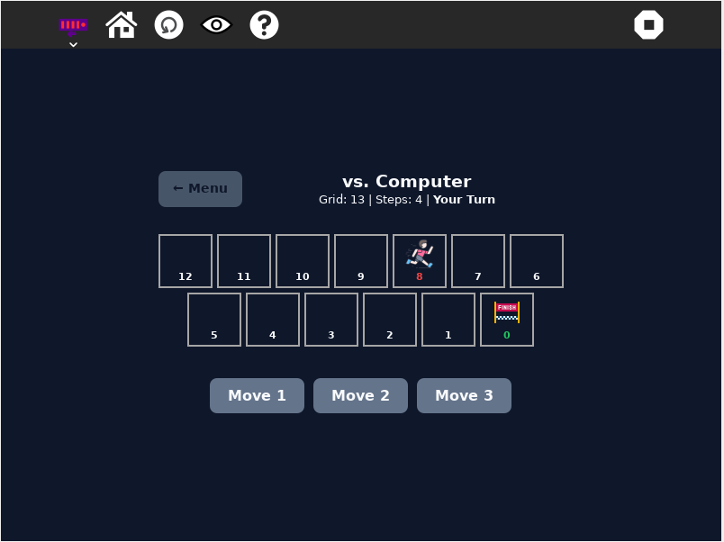
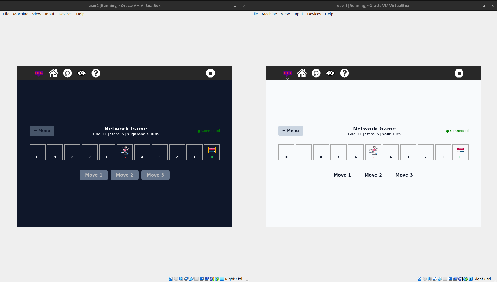

# Odd Scoring Game


## 🎯 Overview

The Odd Scoring Game is a strategic mathematical puzzle that combines position-based movement with parity theory (even/odd numbers). Players must think ahead to control whether the total steps taken will be even or odd to determine victory.



## 🎮 How to Play

1. **Starting Position**: Your character begins at the highest numbered cell
2. **Movement**: Choose to move 1, 2, or 3 spaces toward position 0 each turn
3. **Direction Rule**: You can only move toward 0 - no backwards movement
4. **Game End**: Game ends when any player reaches cell 0
5. **Victory**: Win if total steps taken is **EVEN**, lose if **ODD**




## How to Use

For a step-by-step walkthrough, see the official documentation on installing activities:

[How to Install Activities – Sugar Labs Wiki](https://wiki.sugarlabs.org/go/How_to_install_activities)

Alternatively, for development or testing purposes, you may clone or copy the activity directory into your `~/Activities` folder and then restart Sugar to have it appear in the activity ring:

```bash
git clone <repository-url> ~/Activities/<activity-name>

cp -r /path/to/local/activity ~/Activities/
```